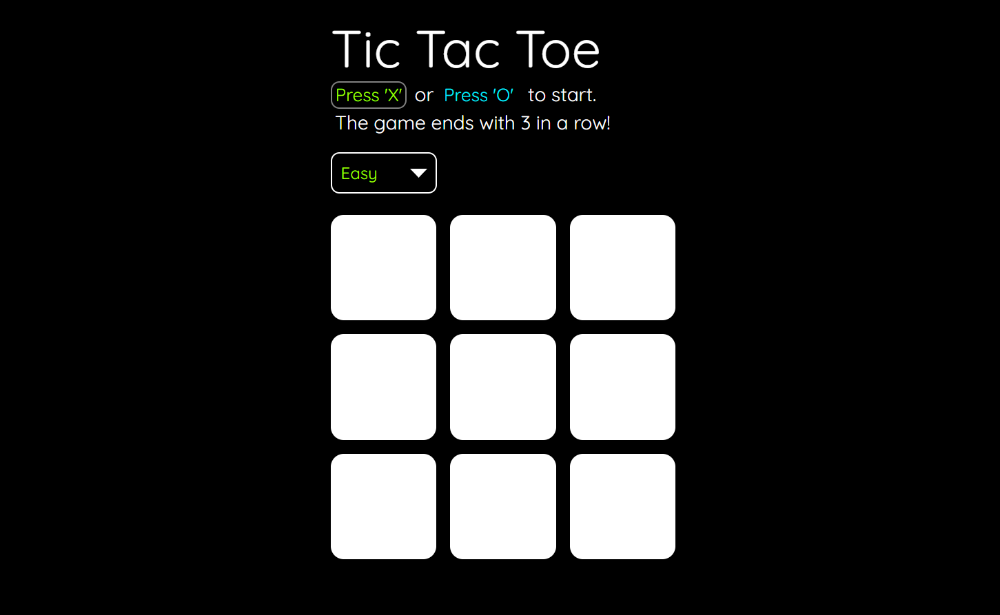

# Tic Tac Toe

> The Tic Tac Toe website's main interface
---
## Description

link: https://ycheng11065.github.io/TicTacToe_app/

Challenge yourself against three varying levels of AI difficulty with this engaging and straightforward web-based TicTacToe game.

Easy - AI chooses random valid moves  
Medium - AI uses Minimax with a depth constraint of 2  
Hard - AI uses Minimax (technically impossible to beat)  

#### Technologies

- Javascript
- CSS
- HTML

---
## Usage
- Allow users to select their preferred game piece by providing the options to press 'X' or 'O', with 'X' always going first
- Provide users with a drop-down menu to select the desired difficulty level of the AI opponent
- Enable users to restart the game at any time by pressing the 'R' key on their keyboard

---
Created for the ODIN project